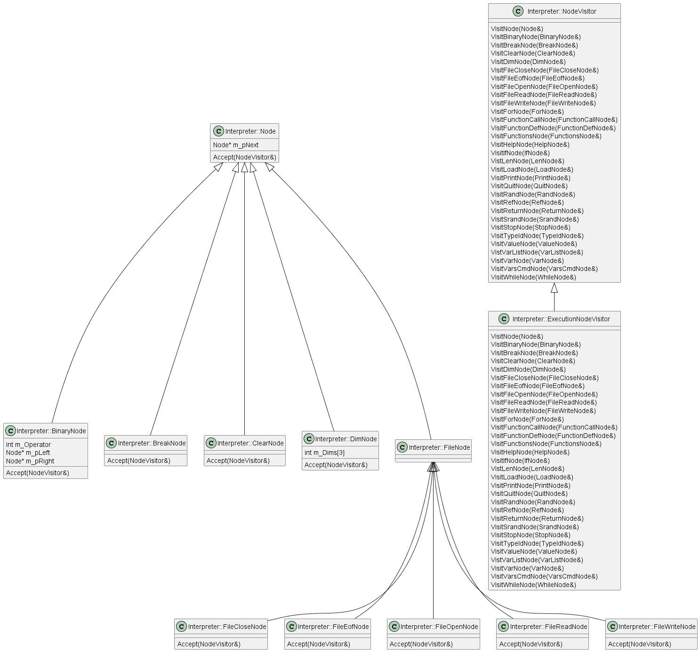
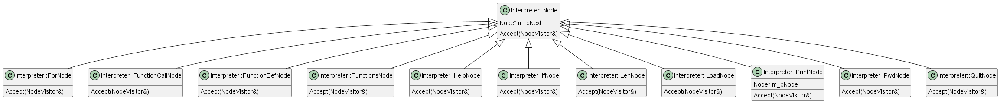
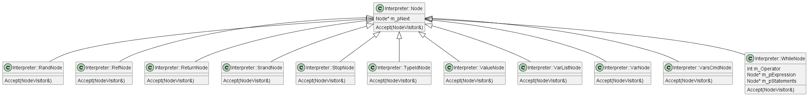

[[_TOC_]]

# Overview
The InterpreterProject is an interpreter having a simple grammar.  The implementation of the interpreter is done using the freely-available [Visual Studio Community C++ Version](https://visualstudio.microsoft.com/vs/community/). The parser is constructed using [GNU Bison](https://www.gnu.org/software/bison/).  The parser produces a set of nodes that represent a linked-list of binary trees.  The nodes are then evaluated using the popular Visitor design pattern.  The interpreter can be run in a file mode or interactive mode.

## Language

The language of the interpreter consists of the following major features:

1.  Expressions with C-Style Operators
    - +,-,/,*,
    - <,>,>=,<=
    - !=, ==
    - &&, ||
    - ^, |, &,
    - ~
1.  Atomic Types:  CHAR, UINT, INT, FLT, and STR.
1.  Arrays
1.  Variables:  Global and Local Scope
1.  Literals:  Binary, Decimal, and Hexadecimal
1.  Built-in Functions:  srand(), rand(), len(), typeid(), load(), print(), help().
1.  Interpreter Functions:  .vars, .functions, .quit.
1.  Control Loops:  For and While
1.  Conditional Statements:  if, else, etc...
1.  Functions with Parameters and Return
1.  Reference Parameters
1.  Multiple Assignments:  {a,b} = {1,2}

### Expressions with C-Style Operators

The expressions should be very self-explanatory.  Here are examples in interactive mode:

```
>8+9
=17>90*8-9/9+4
=723>

>0xf | 0xf0
=255U>

and so on and so forth...
```

### Atomic Types:  CHAR, UINT, INT, FLT, and STR
The interpreter supports the C-Style: char, unsigned int, int, float, and std::string types.  An example from the interpreter is shown here:

```
>a='a'
>b=0x89
>c=5
>d=5.5
>e="My String"
>.vars
Symbol Table Name:  GLOBAL
NAME                  TYPE   DIMS          VALUE(S)
===================================================
a                     CHAR   ---           a
b                     UINT   ---           137U
c                     INT    ---           5
d                     FLT    ---           5.5
e                     STR    ---           My String
main                  INT    ---           0
```

### Arrays
The interpreter also supports arrays of all the Atomic Types from the previous section.  The array variables may be 1, 2, or 3 dimensions.  When an array is created, by default it starts out as an array of INTs.  It transforms itself to other types as elements are written to the array.  Examples are shown here:

```
>a=dim[10]
>b=dim[10,10]
>c=dim[10,10,10]
>.vars
Symbol Table Name:  GLOBAL
NAME                  TYPE   DIMS          VALUE(S)
===================================================
a                     INT    [10]          0 0 0 0 0 0 0 0 0 0 ...
b                     INT    [10,10]       0 0 0 0 0 0 0 0 0 0 ...
c                     INT    [10,10,10]    0 0 0 0 0 0 0 0 0 0 ...
main                  INT    ---           0
```

As shown above, the values are displayed as a flat array even for multi-dimensional arrays.  With 2-dimensional arrays defined as array[r,c], r represents the row in the array, and c represents the column.  The total number of elements in the array is r*c.  With 3-dimensional arrays, array[m,r,c], r and c are the same as before, and m is the matrix selector.

### Variables
Variables are represented by the typical regular expression:  [a-zA-Z][a-zA-Z0-9]*.  Variables may appear in assignments, expressions, and parameters to functions.  They can have both a global and local scope.  They have a local scope when they are used as parameters to functions.  They also have a local scope when they are created locally within a function.  They can be displayed using the .vars command.

### Literals
Literals are also used in the interpreter to represent numbers in binary, decimal, or hexadecimal format.  Examples are:

1.  Binary:       0b11011001
1.  Decimal:      -98797863
1.  Hexadecimal:  0x76fabcde

To make long literals more readable, underscores(_) may be used to express the literal such as:

1.  Binary:       0b1101_1001
1.  Decimal:      -98_797_863
1.  Hexadecimal:  0x76fa_bcde

### Built-In-Functions

There are several built-in-functions that may be used as part of the interpreter

1.  Built-in Functions:  srand(), rand(), len(), typeid(), load(), print(), help().

| Built-In-Function | Description                             | Example         |
|-------------------|-----------------------------------------|-----------------|
| srand()           | Seeds the random number generator.      | srand(123)      |
| rand()            | Generates a random number.              | x = rand()      |
| len()             | Returns the dimensions of an array.  Also returns the length of a string. | a=dim[10] x=len(a) |
| typeid()          | Returns the type of a variable as a string.| x = typeid(a) |
| load()            | Loads an executes interpreter commands from a file. | load("TestFiles\ArrayTests.irp") |
| print()           | Prints to standard output.              | print(x, endl) |
| help()            | Prints the help text for the interpreter| help()         |


### Interpreter Functions

The Interpreter has several functions that shows the current state of the interpreter.  The .vars command displays all the global and local variables that have been currently been created.  The .functions command displays the current functions that have been defined.  The .quit command exits the interactive interpreter.

### Control Loops

The interpreter supports 2 control loops:  for and while.  A for and while loop look simply like:

```
for (i=0, i < 10, i=i+1)
{
    b=a[i]+1
    ...
    if (i==4)
    {
        break
    }
}

while (flag != 0)
{
    ...
    flag = 0
}
```

### Conditional Statements

The interpreter supports the obvious if else statements as shown here:

```
if ( flowValue > THRESHOLD )
{
    print("Warning the flow is greater than:  ", THRESHOLD, " Current value:  ", flowValue, endl)
}
else if (flowValue == THRESHOLD)
{
    print("Warning the flow is equal to:  ", THRESHOLD, endl)
}
else
{
    print("Flow is normal.", endl)
}
```

### Operators

The following table shows the operators that are currently supported, their descriptions, and precedence.

| Operator | Description                             | Priority         |  Example |
|----------|-----------------------------------------|------------------|----------|
| ()       | Parenthesis                             | 1                | (9+8)*6  |
| -        | Unary negate                            | 2                | -5       |
| *        | Binary Multiplication                   | 3                | 9*8      |
| /        | Binary Division                         | 3                | 8/2      |
| +        | Binary Addition                         | 4                | 9+7      |
| -        | Binary Subtraction                      | 4                | 9-7      |
| ~        | Unary Bitwise Negate                    | 5                | ~a       |
| |        | Binary Bitwise Or                       | 5                | a | b    |
| &        | Binary Bitwise And                      | 5                | a & b    |
| ^        | Binary Bitwise Xor                      | 5                | a ^ b    |
| <<       | Binary Bitwise Lsh                      | 5                | a << 3   |
| >>       | Binary Bitwise Rsh                      | 5                | a >> 3   |
| >>       | Binary Bitwise Rsh                      | 5                | a >> 3   |
| or       | Binary Logical Or                       | 5                | a or b   |
| and      | Binary Logical And                      | 5                | a and b  |
| <        | Binary Less than                        | 6                | a < b    |
| <=       | Binary Less than or Equal To            | 6                | a <= b   |
| >        | Binary Greater than                     | 6                | a < b    |
| >=       | Binary Greater than or Equal To         | 6                | a <= b   |
| ==       | Binary Is Equal To                      | 7                | a == b   |
| !=       | Binary Is Not Equal To                  | 7                | a != b   |

### Functions

The interpreter also supports functions with parameters and return statements.  The following example shows the usage of functions.

```
function AddNumbers(a,b)
{
    return(a+b)
}

q = AddNumbers(1,2)
print("q's value is:  ", q, endl)
```

The simple example above shows a simple add function that returns the sum of 2 parameters.  The sum is then stored in the variable q.  Variables a and b are local variables of the function AddNumbers.  The function uses the return statement to return the sum.  When arguments are passed to the function, the arguments are copied in as new local variables to the function.  Those variables are created when the function is invoked and are deleted when the function exits.  Whole arrays may also be passed in as parameters.

### Reference parameters

The interpreter also supports reference parameters.  Instead of making a copy of the variable, the interpreter creates a reference to it.  Consider this example:

```
function FindMax(&array)
{
    maximumValue = -1
    for (i=0, i < len(array), i=i+1)
    {
        if (array[i] > maximumValue)
        {
            maximumValue = array[i]
        }
    }

    return (maximumValue)
}

a = dim[10]
// Fill a with values
...
maximum = FindMax(a)
print("Maximum value of a is:  ", maximum, endl)
```

This function finds the maximum value in an array of values.  Note the reference parameter, array.  The interpreter does not not copy the entire array, a, into another local variable of size=len(a); however, it creates a reference parameter denoted by the & symbol called array.

### Multiple Assignments

The interpreter supports the notion of multiple assignments in one statement.  Consider the following sample:

```
{a,b} = {0,1}
```

The above sample assigns the values 0 and 1 to a and b, respectively.

Multiple assignments may be used in functions to return multiple values.

```
function foo()
{
    return {3,4}
}

{q,r} = foo()
```

## Design

The following sections describe the object-oriented C++ design for the Interpreter.

### Static Diagram


This table describes each of the classes/modules in the diagram.  All of the classes/modules live in the Interpreter namespace except the main function.

| Module/Class | Description                                                                             |
| ------------ | --------------------------------------------------------------------------------------- |
| main         | This is the main function in the C++ project. Uses the Driver to Parse the input stream, generate a set of Nodes, and traverse and Execute the Nodes.                                                      |
| Driver       | Contains the main Parsing and Execution routines.  It is the owner of the Parser class. |
| Parser       | Contains all the grammar rules for the Interpreter.  Uses the Scanner to tokenize the input stream.  Produces a set of Nodes for the main function.                                                  |
| Scanner      | Tokenizes the input stream into a series of tokens used by the Parser.  The input stream is either a string or file.                                                                                 |
| Node         | A hierarchy of nodes representing the Interpreter language.  They are defined in further detail later on.                                                                                                |
| NodeVisitor | A Visitor Design Pattern used to traverse a linked list of Nodes.                        |
| ExecutionNodeVisitor | The Visitor used to execute the Nodes present in the linked list.               |

### Node Static Diagram

The following diagrams show the Node hierarchy in more detail.



This table desribes each of the classes in the diagram.

| Module       | Description                                                                             |
| ------------ | --------------------------------------------------------------------------------------- |
| Node         | This is the base class for all nodes in the hierarchy.  It is a singly-linked list.  It can allow for any NodeVisitor to traverse it and its children.   |
| BinaryNode   | This node represents all the binary expressions such as a+b, a*b, etc...  It has left and right nodes representing its children. |
| BreakNode    | This node represents all the break statement that is present in either for or while loops. |
| ClearNode    | This node represents the clear statement which deletes all variables and function definitions. |
| DimNode      | This node represents the dimension statement:  a = dim[10]. |
| FileCloseNode | This node represents the file close statement:  status = fclose(f). |
| FileEofNode   | This node represents the file eof statement:  status = feof(f). |
| FileNode      | This node represents the base class for all the file commands. |
| FileOpenNode  | This node represents the file open statement:  status = fopen("myfile.txt", "r") |
| FileReadNode  | This node represents the file read statement:  {status,x} = fread(f) |
| FileWriteNode | This node represents the file write statement:  status = fwrite(f,x) |
| ForNode       | This node represents the for statement:  for (i=0, i < 10, i=i+1){} |
| FunctionCallNode | This node represents a function call:  foo(x,y,z+9) |
| FunctionDefNode | This node represents a function definition:  function foo(x,y,z+9){} |
| FunctionsNode | This node represents the functions command:  .functions |
| HelpNode | This node represents the help command:  help() |
| IfNode | This node represents the if statement:  if(x<y) { a = a + 5 } |
| LenNode | This node represents the length statement:  a = dim[10] b = len(a) |
| LoadNode | This node represents the load statement:  load("File.irp") |
| PrintNode | This not represents the print statement:  print(hex, a, endl) |
| QuitNode | This node represents the quit statement:  .quit |






